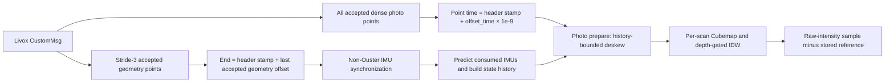

# Livox photo/geometry time-chain audit

Baseline source: `f3060768abee4d2ee2343b07edf62346c7cd0f87`. This stage traces the inherited Livox path and adds optional observations plus the explicitly requested C input filter. It does not repair the parser, synchronization, interpolation, projection, residual equations, selector or estimator.

## Source trace

| Boundary | Source / function | Behavior at the baseline |
|---|---|---|
| Sensor dispatch | [`ROSWrapper.cpp`](../../src/super_lio/src/ros/ROSWrapper.cpp), constructor/initialization | Shield4 config has `lidar_type=1` (Livox); dispatch uses `livox_ros_driver::CustomMsg`. Ouster is enum value 7. |
| Raw point → geometry | `ROSWrapper::livoxHandler` | Loop advances by `g_filter_rate=3`, accepts tags with `(tag & 0x30)` equal to 0 or 0x10 and ranges between blind/maxrange. Stores XYZ, reflectivity and nanosecond offsets converted to seconds. |
| Raw point → photo | Same handler, separate `photo_enabled_` loop | Iterates every raw point with the corresponding tag/range validity checks; stores reflectivity and the same converted per-point offset. It bypasses geometry stride sampling. |
| Geometry → scan end | Same handler | The `offset_time` variable is updated only when a stride-sampled geometry point is accepted. `start_time=header.stamp`; `end_time=start_time+offset_time`. This is the last accepted geometry offset, not a maximum over all raw/photo points. |
| Scan end → IMUs | `ROSWrapper::sync_measure` | Waits for the received IMU stream to reach the scan end. The non-Ouster branch consumes IMU samples before that end; it does not use the Ouster bracketing-window routine. |
| IMUs → history | [`super_lio.cpp`](../../src/super_lio/src/lio/super_lio.cpp), `SuperLIO::Propagation_Undistort` | Clears non-Ouster history, inserts the corrected starting state, calls `ESKF::Predict` on consumed IMUs, and appends resulting states. Setting observation time is distinct from supplying a beyond-end IMU sample. The final propagated timestamp can be earlier than nominal geometry end. |
| Geometry deskew | Same function, non-Ouster branch | Inside the supported interval, uses quaternion slerp and velocity/acceleration position interpolation. Points later than the last propagated state take the raw-point/extrinsic fallback. |
| Photo deskew | [`photo_observation.cpp`](../../src/super_lio/src/intensity/photo_observation.cpp), `PhotoObservation::prepare` | Requires at least two states and a positive total history span. A point is interpolated only for an inclusive timestamp inside `[history.front.time, history.back.time]` and a positive local bracket. Otherwise its initialized raw coordinate is retained. Frames with no usable total history are skipped instead of rasterizing a stale image. |
| Deskew → image/residual | `CubeImage::build`, `PhotoObservation::observe` | Sensor-centric points enter the per-scan raster. With raw measurement, the sampled current intensity is compared with a reference saved at feature birth; ordinary depth/mask/outlier checks still apply. |

## Answers to the cloud/time questions

Geometry and photo clouds originate from the same message but are not identical point sets. The separate dense photo loop is an intentional architecture choice to preserve image support while retaining geometry sampling. Geometry also proceeds to its own voxel/map feature processing. This intended density difference does not imply that the temporal support difference is desirable.

Both paths carry per-point acquisition offsets in seconds. For overlapping points their interpolation design is similar, but they are separate implementations and use different output coordinate frames: geometry is expressed in the body frame, and the photo path returns to sensor-centric coordinates using the configured extrinsic. The audit does not assert pointwise bit equality between those paths.

The scan end comes from the last accepted stride-filtered geometry point. Because the photo set is denser, photo acquisition times can exceed that end. In addition, the last consumed/propagated IMU timestamp can precede even the geometry-derived end. Thus photo points can lack an interpolation bracket even if their offsets do not exceed the nominal scan end. Phase 3 measures both `max_photo_time - geometry_end` and `geometry_end - history_last` so these mechanisms can be distinguished.

## Optional diagnostic and C-arm implementation

Both new ROS parameters default to `false` and are available through Shield4-only runner flags:

- `/p3r/photo_time_audit` (`--photo-time-audit`): writes `photo_time_audit.csv` with raw photo counts before any C filtering, history bounds, geometry count/end, maximum photo offset, retained/dropped counts, actual successful deskew count and fallback percentage.
- `/p3r/photo_history_supported_only` (`--photo-history-supported-only`): C arm only. Drops photo inputs outside the same inclusive positive-span history interval before rasterization, preserving the order of remaining inputs. It does not change any interpolation equation, photo weight, normalization rule, range gate, raster, IDW or selector.

Actual successful deskew is recorded with separate per-point bytes after the original interpolation executes; counting these bytes is deterministic and does not alter point values. Unsupported-frame inputs are counted but are marked skipped, with zero actual fallback-rasterized points. The full per-scan CSVs are archived beside the summary JSON.

A and B must reproduce their original P3 trajectory SHA exactly before claiming the instrumentation has preserved normal behavior. C changes only the permitted photo input set; resulting raster support, feature lifecycle and existing automatic normalization may change as consequences of that input intervention. C is a diagnostic comparison, not a production repair.

## Measured result

The completed A run recorded 80,732,252 photo inputs across 3394 processed scans. Of these, 3,991,596 (4.944239633%) were later than the final propagated IMU state and used the fallback. Every processed scan had at least one such point; no points were before the history start, had invalid times, or belonged to a skipped-history frame. The same raw support counts and all recorded time boundaries match C scan by scan; C drops those points and has zero actual fallback points.

The median gap from geometry end to history end is 2.718210 ms; the median gap from photo end to geometry end is only 0.008345 ms. The maximum gaps are 15.755653 ms and 0.158310 ms respectively. Thus the dominant measured unsupported interval comes from the consumed/propagated IMU history ending early, rather than the stride-sampling tail difference alone. “Unsupported” here refers to the estimator's supplied history, not proof that no IMU measurement exists in the bag.

See [`shield4_time_diagnostics.json`](../../artifacts/p3r/shield4_time_diagnostics.json) and complete per-scan [`A`](../../artifacts/p3r/shield4_time_a.csv) / [`C`](../../artifacts/p3r/shield4_time_c.csv) CSVs for every count and boundary. The attribution consequence is reported in [`P3R_SHIELD4_ATTRIBUTION_REPORT.md`](P3R_SHIELD4_ATTRIBUTION_REPORT.md).
